# 1. 开发者注册

登录[中国移动开发者社区][1]注册成为开发者

 

## 1.1. 个人开发者注册流程

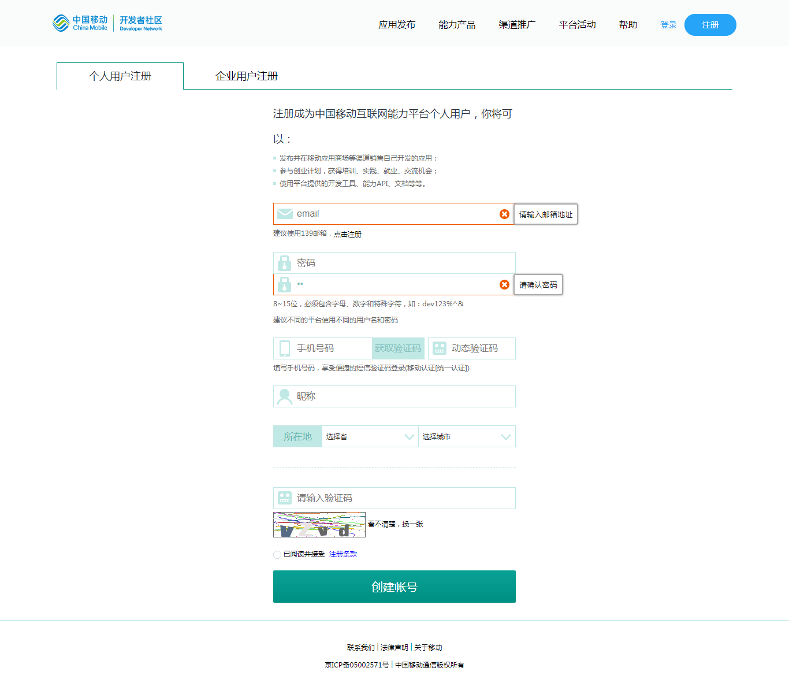

 

## 1.2. 企业开发者注册流程

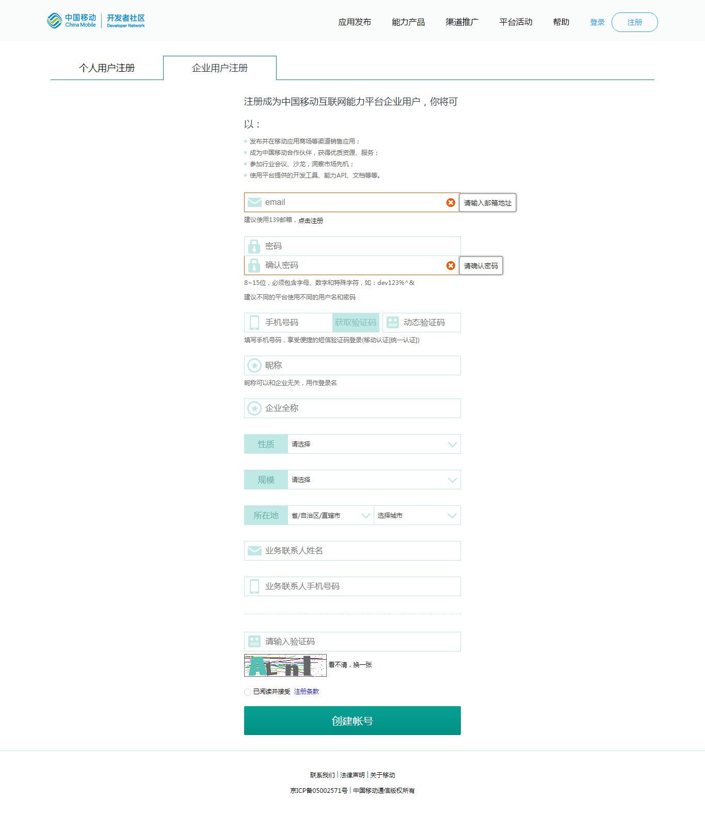

# 2. 应用接入

## 2.1. 创建应用

开发者账号创建后，开发者社区将给您的注册邮箱发一封账号激活邮件，开发者通过邮箱激活账号并登录中国移动开发者社区，如果开发者需要申请使用移动认证能力，从首页进入快捷申请通道

> **登录->管理中心->移动认证快捷申请->新增移动认证应用**

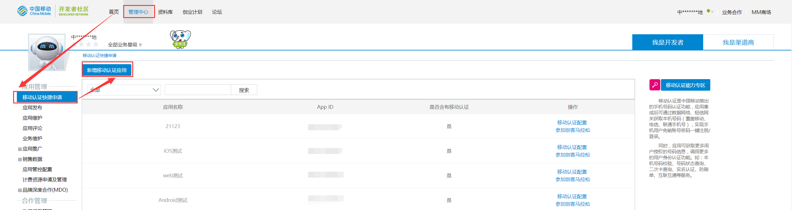

填写开发者的应用信息：

应用创建成功后，在能力配置页面上，将显示开发者的AppID和APP Key信息。**注意：2018年12月26日以后新创建的应用，appkey参数不再作为服务端获取手机号码接口MD5签名校验的参数，所有新增的应用都将改用APPSecret做MD5签名校验**（详细设定请见 目录小节2.2.2.2）

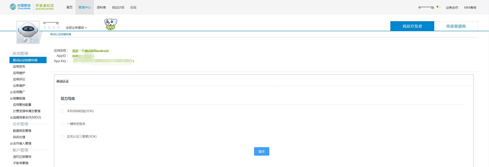

 

## 2.2. 使用一键登录能力

在能力配置页面上勾选“一键免密登录”选项，此时配置页面将会自动展开，此时需要完成：

1. 应用客户端信息填写
2. 应用服务端信息填写

### 2.2.1. 应用客户端信息填写

Android应用：需要填写应用的包名和包签名（即应用签名）

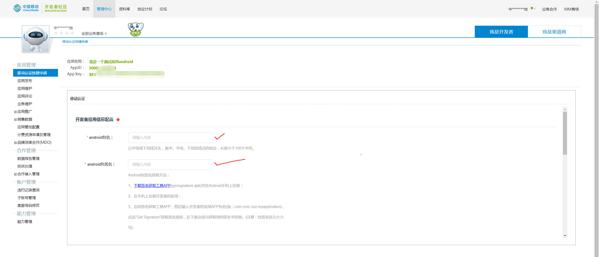

iOS应用：需要填写应用的bundle ID信息

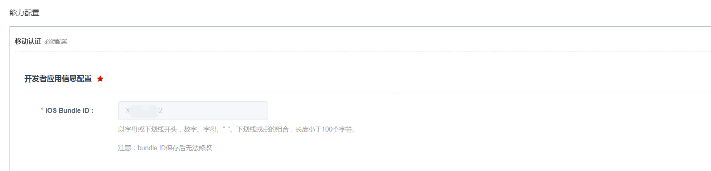

**注意：包名、包签名、bundle ID一旦提交将无法修改！如果需要用其他的包名、包签名、bundle ID，请重新创建应用！**

### 2.2.2. 应用服务端信息填写

#### 2.2.2.1. 出口IP白名单

业务侧服务器接口到移动认证接口访问时，会校验请求服务器的IP地址，防止业务侧用户信息被盗用风险。IP白名单目前同时支持IPv4和IPv6，支持最大4000字符。

IPv4地址支持以下输入格式：

1、支持单独ip用逗号隔开，例如127.0.0.1,127.0.0.2
2、支持ip段（ip段仅支持最末尾一段，后面相同），例如127.0.0.1-127.0.0.2
3、支持ip段+单独ip，用逗号分隔，例如：127.0.0.1-127.0.0.2，127.0.0.3
4、支持ip段+ip段，用逗号分隔，例如：127.0.0.1-127.0.0.2，127.0.0.3-127.0.0.4

IPv6地址支持以下输入格式：

1、总共8字节，分为8段，用冒号隔开，每段由4个16进制字符表示。

2、范围：0000:0000:0000:0000:0000:0000:0000:0000至ffff:ffff:ffff:ffff:ffff:ffff:ffff:ffff

3、可省略前导0。例如1050:0000:0000:0000:0005:0600:300c:326b 可写为 1050:0:0:0:5:600:300c:326b。

4、可通过使用双冒号(::)代替连续的零。例如 ff06:0:0:0:0:0:0:c3 可写为 ff06::c3，一个IP地址只可使用一次双冒号

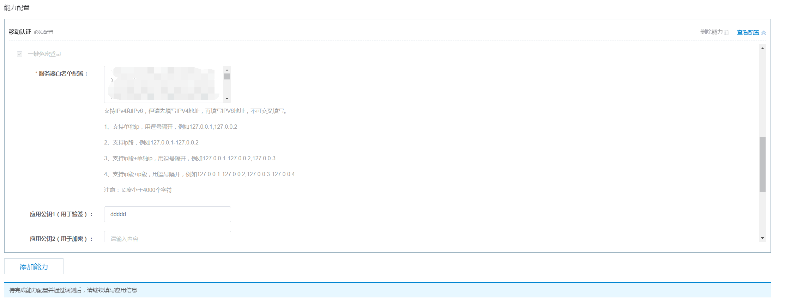

#### 2.2.2.2. MD5签名校验配置

移动认证服务端默认使用MD5对请求进行签名校验，集成的步骤如下：

步骤1：进入开发者社区打开需要修改的应用的能力配置页面

步骤2：获取APP Secret，在一键免密登录能力配置下方显示APP专用的secret

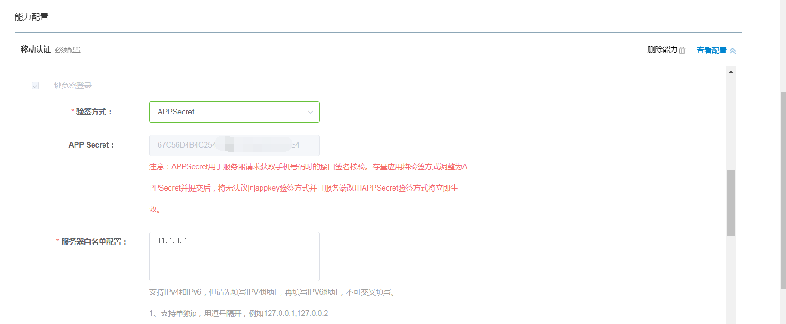

步骤2.1：对于存量应用（2018年12月26日前创建的应用），在一键免密登录能力配置下方，默认验签方式仍然是appkey，开发者可以将appkey修改为APPSecret，保证服务端请求的安全可靠。

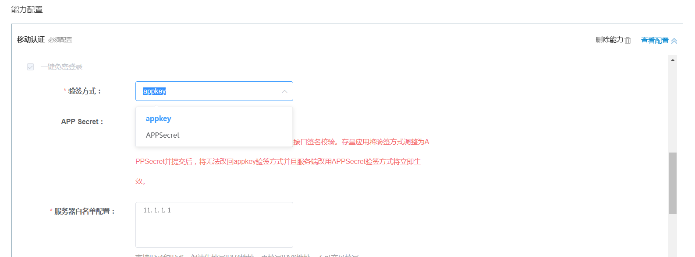

步骤3：提交修改后，立即生效。（对于存量应用，一旦调整验签方式并提交后，将无法再继续使用appkey签名，需**谨慎修改**）

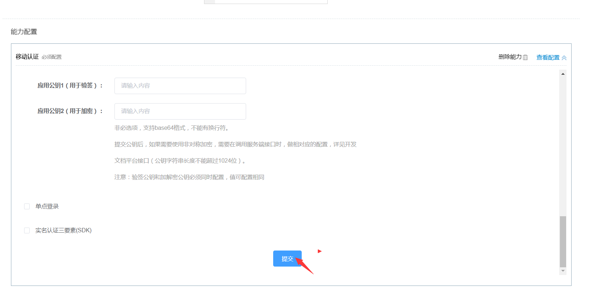

步骤4：生效后，在调用服务端获取手机号码接口生成sign签名算法时，使用APPSecret参数保证请求源安全可信（对于存量应用，将appkey调整为APPSecret后，**如果在开发者社区提交后但未及时修改服务端的请求，会返回签名失败的错误**）【修改后请及时和您服务端同事沟通修改相关参数】

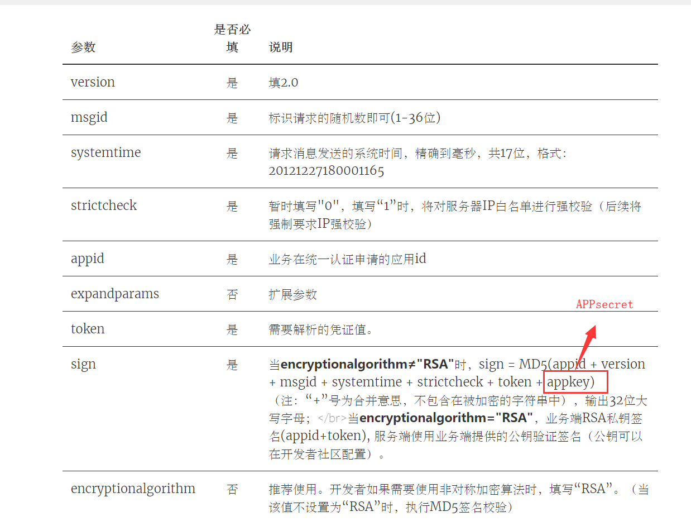

#### 2.2.2.3. RSA签名校验配置

如果开发者在调用接口时，选择RSA加密方式，那么需要在能力配置页面上填写base64编码后的**验签和加解密的公钥**

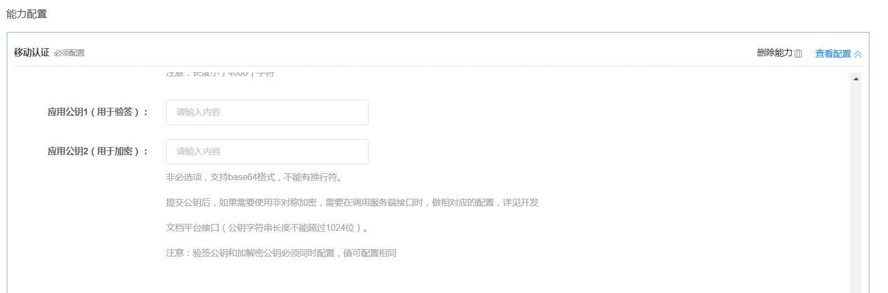

验签和解密的公钥可以一样，**但必须都要填写**，否则取号会出错

### 2.2.3. 完成配置

配置完成后，提交并点击下一步，能力配置完成，就可以下载SDK进行联调测试了。

## 2.3. 使用本机号码校验能力

本机号码校验是收费产品，创建应用时会默认赠送1000次/天，共计60天的免费校验量供开发者调试用，后续如需使用请订购合同版

### 2.3.1. 应用客户端信息填写

Android应用：需要填写应用的包名和包签名（即应用签名）

iOS应用：需要填写应用的bundle ID信息

**注意：包名、包签名、bundle ID一旦提交将无法修改！如果需要用其他的包名、包签名、bundle ID，请重新创建应用！**

### 2.3.2. 应用服务端信息填写

#### 2.3.2.1. 出口IP白名单

业务侧服务器接口到移动认证接口访问时，会校验请求服务器的IP地址，防止业务侧用户信息被盗用风险。IP白名单目前同时支持IPv4和IPv6，支持最大4000字符。

IPv4地址支持以下输入格式：

1、支持单独ip用逗号隔开，例如127.0.0.1,127.0.0.2
2、支持ip段（ip段仅支持最末尾一段，后面相同），例如127.0.0.1-127.0.0.2
3、支持ip段+单独ip，用逗号分隔，例如：127.0.0.1-127.0.0.2，127.0.0.3
4、支持ip段+ip段，用逗号分隔，例如：127.0.0.1-127.0.0.2，127.0.0.3-127.0.0.4

IPv6地址支持以下输入格式：

1、总共8字节，分为8段，用冒号隔开，每段由4个16进制字符表示。

2、范围：0000:0000:0000:0000:0000:0000:0000:0000至ffff:ffff:ffff:ffff:ffff:ffff:ffff:ffff

3、可省略前导0。例如1050:0000:0000:0000:0005:0600:300c:326b 可写为 1050:0:0:0:5:600:300c:326b。

4、可通过使用双冒号(::)代替连续的零。例如 ff06:0:0:0:0:0:0:c3 可写为 ff06::c3，一个IP地址只可使用一次双冒号

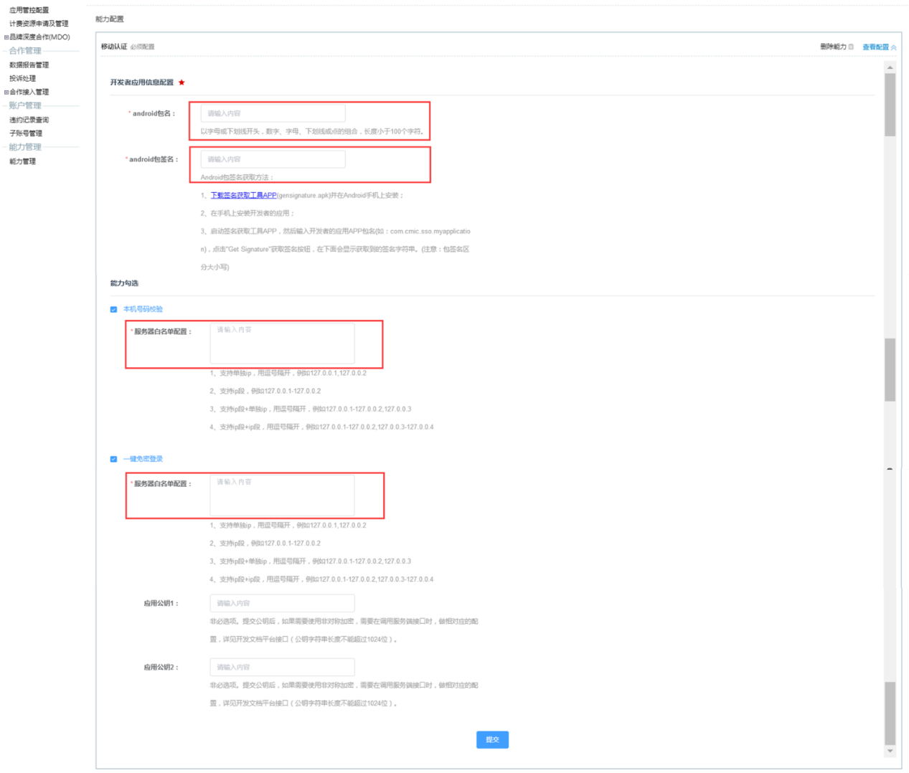

#### 2.3.2.2. 短验辅助开关

在校验本机号码时，服务端校验结果为非本机号码时，允许调用短信下发和短验校验接口作为补充校验服务。如果需要使用短验辅助功能，必须先在开发者社区->能力配置->本机号码校验能力中将本机号码校验短验辅助开关打开

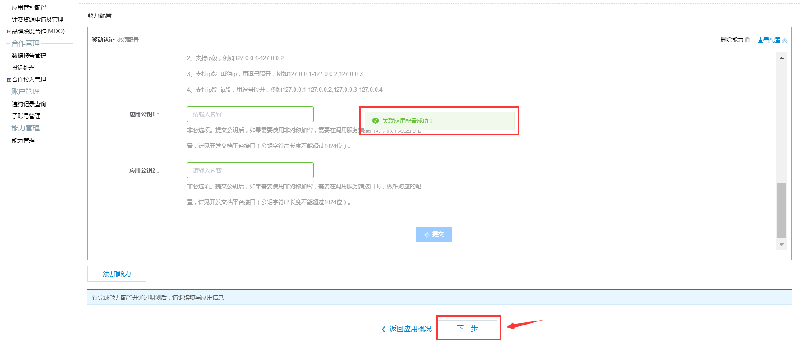

[1]: http://dev.10086.cn/	"开发者社区"
[2]: http://dev.10086.cn/cmpassport/download/gensignature.apk	"签名获取工具"
