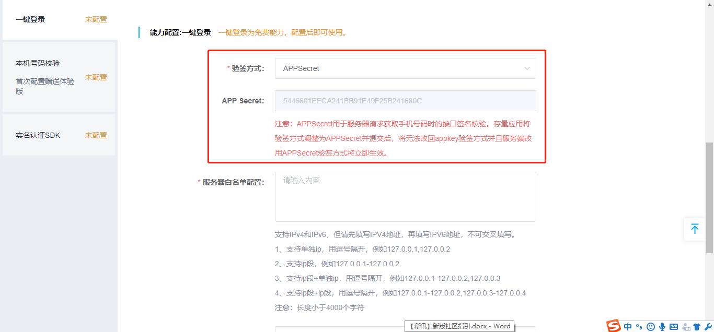

# 一. 开发者注册

**移动认证接入可分为：开发者注册→能力配置→能力接入三步。若已注册【中国移动开发者社区】的开发者，可跳过此节。**

1.1. 访问[中国移动开发者社区](http://dev.10086.cn/)，点击【注册】

 

1.2. 根据字段说明填写必要信息后，点击【注册】

**注：**

- 注册邮箱与手机号码，将用于修改密码、接收登录安全信息、接收合作信息等。
- 如您是企业开发者，建议使用公用邮箱及公用手机号码，避免人员变动等原因带来的不必要麻烦；
- 如确需使用个人邮箱及手机号码注册的，也可在工作交接时使用修改邮箱及修改手机号码功能完成交接。

1.3. 注册成功后，前往注册邮箱进行**【激活】**

 

 

# 二. 应用能力配置

开发者账号创建后，开发者社区将给您的注册邮箱发一封账号激活邮件，开发者通过邮箱激活账号并登录中国移动开发者社区，如果开发者需要申请使用移动认证能力，从首页进入管理中心，点击移动认证管理业务即可进入创建应用页面。

## 2.1. 进入管理中心

2.1.1. 进入门户（ dev.10086.cn），点击**【登录】**

2.1.2.登录成功，点击移动认证业务下方按钮**【进入管理】**

## 2.2. 创建应用

### 2.2.1. 点击**【创建应用】**

 

### 2.2.2. 填写应用的客户端信息

- 填写应用名称，并根据所属平台，填写**包名包签名或bundle ID**

  

  

**注意：包名、包签名、bundle ID一旦提交将无法修改！如果需要用其他的包名、包签名、bundle ID，请重新创建应用！**

 

## 2.3. 一键登录能力配置

### 2.3.1. 选择一键登录能力

在页面左侧选择一键登录能力

 

### 2.3.2. 应用服务端信息填写

#### 2.3.2.1. 出口IP白名单

业务侧服务器接口到移动认证接口访问时，会校验请求服务器的IP地址，防止业务侧用户信息被盗用风险。IP白名单目前同时支持IPv4和IPv6，支持最大4000字符。

**IPv4地址支持以下输入格式：**

（1）支持单独ip用逗号隔开，例如127.0.0.1,127.0.0.2 

（2）支持ip段（ip段仅支持最末尾一段，后面相同），例如127.0.0.1-127.0.0.2 

（3）支持ip段+单独ip，用逗号分隔，例如：127.0.0.1-127.0.0.2，127.0.0.3 

（4）支持ip段+ip段，用逗号分隔，例如： 127.0.0.1-127.0.0.2，127.0.0.3-127.0.0.4 

**IPv6地址支持以下输入格式： **

（1）总共8字节，分为8段，用冒号隔开，每段由4个16进制字符表示。 

（2）范围：0000:0000:0000:0000:0000:0000:0000:0000至 ::::::: 

（3）可省略前导0。例如1050:0000:0000:0000:0005:0600:300c:326b 可写为 1050:0:0:0:5:600:300c:326b。 

（4）可通过使用双冒号(::)代替连续的零。例如06:0:0:0:0:0:0:c3可写为06::c3，一个IP地址只可使用一次双冒号

**注：服务器IP白名单配置后可以修改**

 

#### 2.3.2.2. MD5签名校验配置 

移动认证服务端默认使用MD5对请求进行签名校验，集成的步骤如下： 

步骤1：进入开发者社区打开需要修改的应用的能力配置页面 

步骤2：获取APP Secret，在一键免密登录能力配置下方显示APP专用的secret

对于存量应用（**2018年12月26日前创建的应用**），在一键免密登录能力配置下方，默认验签方式仍然是appkey，开发者可以将appkey修改为APPSecret，保证服务端请求的安全可靠。

**修改步骤：**

1. 进入开发者社区打开需要修改的能力配置页面；

1. 在一键登录能力下面，将“验签方式”改为“APP Secret”；

   

1. 选中“APP Secret”后，将显示该app专用的APPSecret；

   

 

1. 提交修改后，立即生效。（对于存量应用，一旦调整验签方式并提交后，将无法再继续使用appkey签名，**需谨慎修改**）；

   

1. 生效后，需要调整服务端接口中签名生成的参数，将原有的appkey修改为APPSecret，**如果在开发者社区提交后但未及时修改服务端的请求，会返回签名失败的错误。**【修改时请及时和您服务端同事沟通修改相关参数】

   

 

#### 2.3.2.3. RSA签名校验配置（可选）

如果开发者在调用接口时，选择RSA加密方式，那么需要在能力配置页面上填写base64 编码后的验签和加解密的公钥，验签和解密的公钥可以一样，**但必须都要填写**，否则取号会出错。

 

#### 2.3.2.4. 完成配置

配置完成后，点击提交，能力配置完成，就可以下载SDK进行联调测试了。

 

## 2.4. 本机号码校验配置

### 2.4.1. 选择本机号码校验能力

在页面左侧选择本机号码校验能力

 

### 2.4.2. 应用服务端信息填写

业务侧服务器接口到移动认证接口访问时，会校验请求服务器的IP地址，防止业务侧用 户信息被盗用风险。IP白名单目前同时支持IPv4和IPv6，支持最大4000字符。

**IPv4地址支持以下输入格式:**

1. 支持单独ip用逗号隔开，例如127.0.0.1,127.0.0.2 2
2. 支持ip段(ip段仅支持最末尾 一段，后面相同)，例如127.0.0.1-127.0.0.2 3
3. 支持ip段+单独ip，用逗号分隔，例 如:127.0.0.1-127.0.0.2，127.0.0.3 4
4. 支持ip段+ip段，用逗号分隔，例如: 127.0.0.1-127.0.0.2，127.0.0.3-127.0.0.4

**IPv6地址支持以下输入格式: **

1. 总共8字节，分为8段，用冒号隔开，每段由4个16进制字符表示。
2. 范围:0000:0000:0000:0000:0000:0000:0000:0000至   :  :  :  :  :  :  :  
3. 可省略前导0。例如1050:0000:0000:0000:0005:0600:300c:326b 可写为 1050:0:0:0:5:600:300c:326b。
4. 可通过使用双冒号(::)代替连续的零。例如  06:0:0:0:0:0:0:c3 可写为  06::c3， 一个IP地址只可使用一次双冒号

 

### 2.4.3. 短验辅助开关

在校验本机号码时，服务端校验结果为非本机号码时，允许调用短信下发和短验校验接 口作为补充校验服务。如果需要使用短验辅助功能，必须先在开发者社区->能力配置-> 本机号码校验能力中将本机号码校验短验辅助开关打开

 

### 2.4.4. 应用商用

使用付费能力前，每个应用从发起初次调用开始，将有60天的免费体验期，每天赠送1000次，超过1000次停止调用。如该应用超过免费体验期或需要放量付费使用，需将该应用关联到付费合同里（一经关联不再赠送体验版）。点击需要关联合同的应用->找到需要关联的合同点击“绑定”。该页面同样可针对已绑定的应用进行解绑操作。

 
